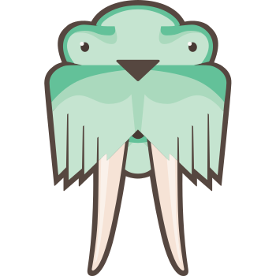
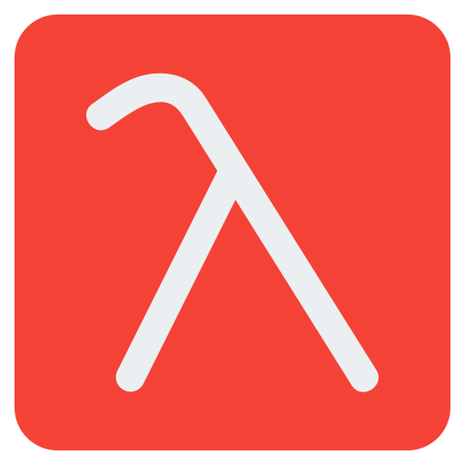

<h1 align="center">Hi , I'm <i><b>Abdul-Basit-Ansari💯</b></i></h1>

<!-- animation start  -->

<!-- animation end  -->

<!-- <h3 align="center">A passionate Full-Stack Developer from Karachi, Pakistan❤️</h3> -->

<h3 style="margin-top: 4px;">MAKING CODE BENEFICIAL!</h3>
- 💪🏻 Enthusiastic 
- 🏆 I am a <b>Certified Python/Django Developer</b> 
- 🌱 I’m currently learning <b>MERN Stack Web Development</b> 
- 👀 I am interested in Programming,Backend Development and in Bug Bounty and Hackathons  
- 💞️ Always looking forward to collaborate on projects 
- 💻 Dedicated to Work and seeking Experiences  
- ⛳️ MY 2022 Goal is Mastering JavaScript 
-    A passionate Full-Stack Developer from Karachi, Pakistan❤️ 
-    (hope you see me coming😉)  

<h3 align="left">📫 Connect with me on 🔗 :</h3>

	
	<!--  -->
	
	
	<!--  -->
	<!--  -->
	<!-- -->
	

<h3 align="left">Languages and Tools ⚙️ : </h3>

	
	
	
	<!--  -->
	
	
	
	
	
	<!--  -->
	
	
	<a href="https://www.w3schools.com/nodejs/nodejs_intro.asp" target="_blank" rel="noreferrer"
		title="NodeJS JavaScript Engin used for BackEnd" style="text-decoration: none;">
		
		<!-- https://nodejs.org -->
	</a>
	
        
	
        
	
	<a href="https://mui.com/" target="_blank" title="Material UI (designing)" style="text-decoration: none;">
		<svg xmlns="http://www.w3.org/2000/svg" width="30" height="32" viewBox="0 0 36 32" fill="none"
			class="css-1170n61">
			<path fill-rule="evenodd" clip-rule="evenodd"
				d="M30.343 21.976a1 1 0 00.502-.864l.018-5.787a1 1 0 01.502-.864l3.137-1.802a1 1 0 011.498.867v10.521a1 1 0 01-.502.867l-11.839 6.8a1 1 0 01-.994.001l-9.291-5.314a1 1 0 01-.504-.868v-5.305c0-.006.007-.01.013-.007.005.003.012 0 .012-.007v-.006c0-.004.002-.008.006-.01l7.652-4.396c.007-.004.004-.015-.004-.015a.008.008 0 01-.008-.008l.015-5.201a1 1 0 00-1.5-.87l-5.687 3.277a1 1 0 01-.998 0L6.666 9.7a1 1 0 00-1.499.866v9.4a1 1 0 01-1.496.869l-3.166-1.81a1 1 0 01-.504-.87l.028-16.43A1 1 0 011.527.86l10.845 6.229a1 1 0 00.996 0L24.21.86a1 1 0 011.498.868v16.434a1 1 0 01-.501.867l-5.678 3.27a1 1 0 00.004 1.735l3.132 1.783a1 1 0 00.993-.002l6.685-3.839zM31 7.234a1 1 0 001.514.857l3-1.8A1 1 0 0036 5.434V1.766A1 1 0 0034.486.91l-3 1.8a1 1 0 00-.486.857v3.668z"
				fill="#007FFF"></path>
		</svg>
	</a>
        
	
	

<h3 align="left">🏫 Plans of Learning :</h3>

	
	
	
	
	
	
	
        
	
	
        
	
	
	
	
        
	
        
	
	
	
	
	
	<a href="https://formik.org/" target="_blank" title="Build Form in REACT" style="text-decoration: none;">
		
		<!-- npm  https://www.npmjs.com/package/yup -->
	</a>

	<!-- <a href="https://miragejs.com/tutorial/intro/" target="_blank" title="API Mocking Servers with Mirage.JS"
		style="text-decoration: none;">
		<svg viewBox="0 0 79 69" fill="none" width="50px" class="w-8 sm:w-10">
			<path fill-rule="evenodd" clip-rule="evenodd"
				d="M0 46.081a2 2 0 012-2h74.724a2 2 0 110 4H2a2 2 0 01-2-2zM15.35 56.081c0-1.103.893-1.997 1.996-1.997h44.031a1.997 1.997 0 010 3.994H17.346a1.997 1.997 0 01-1.997-1.997zM30.694 66.081a2 2 0 012-2h13.335a2 2 0 010 4H32.694a2 2 0 01-2-2z"
				fill="#05C77E"></path>
			<path fill-rule="evenodd" clip-rule="evenodd"
				d="M51.736 14.254a2 2 0 011.67 1.021L70.12 45.103a2 2 0 11-3.49 1.956L51.517 20.087l-7.785 11.725A2 2 0 0140.4 29.6l9.595-14.453a2 2 0 011.741-.893z"
				fill="#05C77E"></path>
			<path
				d="M54.661.125c7.183 0 13.006 5.823 13.006 13.006 0 5.638-3.587 10.438-8.604 12.242l-1.869-3.337a9.26 9.26 0 006.723-8.905 9.256 9.256 0 10-18.512 0c0 2.207.772 4.233 2.062 5.824l-2.144 3.23a12.963 12.963 0 01-3.668-9.054c0-7.183 5.823-13.006 13.006-13.006z"
				fill="#05C77E"></path>
			<path fill-rule="evenodd" clip-rule="evenodd"
				d="M29.522 9.868a2 2 0 011.74.906l22.33 34.214a2 2 0 01-3.349 2.186L29.715 15.721l-17.624 31.34a2 2 0 01-3.486-1.96l19.24-34.214a2 2 0 011.677-1.019z"
				fill="#05C77E"></path>
		</svg>
	</a> -->
	<!--  -->

 

	

 

	

 

	

<!-- (https://camo.githubusercontent.com/117d0191569b7e00e69062ce99d26fe9c251dc735c57386b497c75b0b26dda08/68747470733a2f2f63646e2e6472696262626c652e636f6d2f75736572732f313035393538332f73637265656e73686f74732f343137313336372f636f64696e672d667265616b2e676966) photo gif

Abdul-Basit-Ansari/Abdul-Basit-Ansari is a ✨ special ✨ repository because its `README.md` (this file) appears on your GitHub profile.
You can click the Preview link to take a look at your changes.
Enthusiastic 💯
Dedicated to Work
Hungry for Experience 😉
I always like to Enjoy my Work that I'm doing
Looking forward to be a Computer teacher and run a Software house😊 -->

