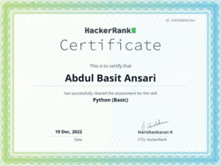
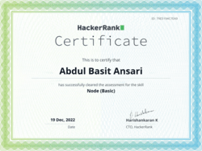

<h1 align="center">Hi , I'm <i><b>Abdul-Basit-Ansari💯</b></i></h1>

<!-- animation start  -->

<!-- animation end  -->

<!-- <h3 align="center">A passionate Full-Stack Developer from Karachi, Pakistan❤️</h3> -->

<h3 style="margin-top: 4px;">MAKING CODE BENEFICIAL!</h3>
- 🌱 I’m Currently Working On<b>Python , REACT JS</b> 
- 💞️ Always looking forward to collaborate on projects 
- 💻 Dedicated to Work and seeking Experiences  
- 🆠I am a <b>Certified Full-Stack Developer</b> 
-    from Karachi, Pakistan❤️ 
- Certified from Saylani MIT / SYSBORG / Hacker Rank / CISCO   ❤️ 
- (hope you see me coming😉)  

<h3 align="left">📫 Connect with me on 🔗 :</h3>

	
	<!--  -->
	
	
	<!--  -->
	<!--  -->
	<!-- -->
	
			 

<h3 align="left">Languages & Frameworks ⚙️ : </h3>

	
	
	
	
	
	
	<a href="https://mui.com/" target="_blank" title="Material UI (designing)" style="text-decoration: none;">
		<svg xmlns="http://www.w3.org/2000/svg" width="30" height="32" viewBox="0 0 36 32" fill="none"
			class="css-1170n61"><path fill-rule="evenodd" clip-rule="evenodd"
				d="M30.343 21.976a1 1 0 00.502-.864l.018-5.787a1 1 0 01.502-.864l3.137-1.802a1 1 0 011.498.867v10.521a1 1 0 01-.502.867l-11.839 6.8a1 1 0 01-.994.001l-9.291-5.314a1 1 0 01-.504-.868v-5.305c0-.006.007-.01.013-.007.005.003.012 0 .012-.007v-.006c0-.004.002-.008.006-.01l7.652-4.396c.007-.004.004-.015-.004-.015a.008.008 0 01-.008-.008l.015-5.201a1 1 0 00-1.5-.87l-5.687 3.277a1 1 0 01-.998 0L6.666 9.7a1 1 0 00-1.499.866v9.4a1 1 0 01-1.496.869l-3.166-1.81a1 1 0 01-.504-.87l.028-16.43A1 1 0 011.527.86l10.845 6.229a1 1 0 00.996 0L24.21.86a1 1 0 011.498.868v16.434a1 1 0 01-.501.867l-5.678 3.27a1 1 0 00.004 1.735l3.132 1.783a1 1 0 00.993-.002l6.685-3.839zM31 7.234a1 1 0 001.514.857l3-1.8A1 1 0 0036 5.434V1.766A1 1 0 0034.486.91l-3 1.8a1 1 0 00-.486.857v3.668z"
				fill="#007FFF"></path></svg>
	</a>
	
	
	
	
		
	
		
	
	
	
	
		

<h3 align="left">Tools ⚙️ : </h3>

	

	
	
	
	
	
	
	
	
	
	

<h3 align="left">🏫 Plans of Learning :</h3>

	
	
	
	

	
	
	
	
	<a href="https://www.docker.com/" target="_blank" rel="noreferrer" title="Docker">
		
		
	</a>
	

 

 

	

		<h1> GitHub Statistics :
			<h1 />
	

	 
	

		
		   
		
		   
		
		   
		
		   
		
		   
		
	

	

		<h1> Certificates :
			<h1 />
	

	 
	

	
	
	
	
	
	
	
	
	
	
		   
	

